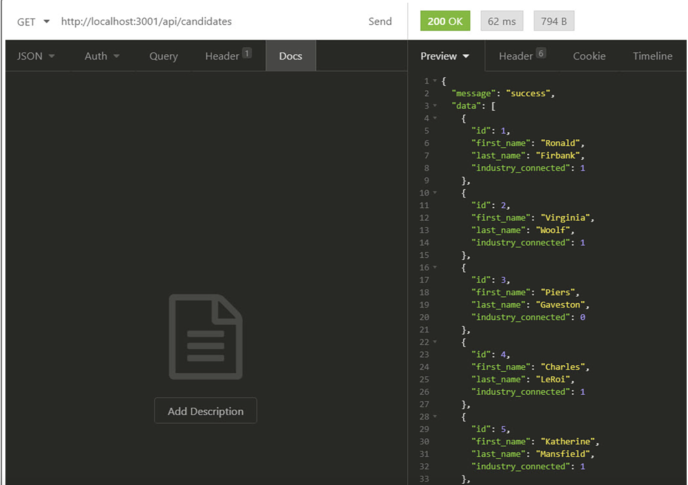

# u-develop-it 

### User Story
As a user, I would like a middleware app tool that I can use with Insomnia. This app will act as a voting tool. This app should track voters, candidates and total votes in a database table.
 
### Features
This app is designed as a middleware app to create and update Database tables.
This tool used MySQL to track voters, Candidates and total votes.
This tool allows you to  add voters, candidates, and populate votes using seed.sq;, chema.sql and using SQL shell commands and Insomnia middleware

### badges

## Table of Contents

- [installation](#installation)
- [contribution guidelines](#contribution)
- [Test Instructions](#testing)
- [License](#license)
- [Questions](#questions)

### Installation
1. You can use the following by cloning the github repository here :  
https://github.com/Vinyldude8896/u-develop-it
2. run npm install to install teh dependancies
3. run npm start to start the servier

### Contribution Guidelines
Current contributers:
Kevin Reid : https://github.com/Vinyldude8896  

### Testing
To test this app: 
1. Clone the repo here : https://github.com/Vinyldude8896/u-develop-it  
2. Install depenencies using npm istall.  
3. from the root folder run npm start  
4. Use Insomnia or an equivalent to text the routes to get, add and delete.
### Questions
    email address : kevinnivek@me.com
    - additional instructions 
    I can be contacted by phone as well, but prefer email contact first.

### Image of sample route
